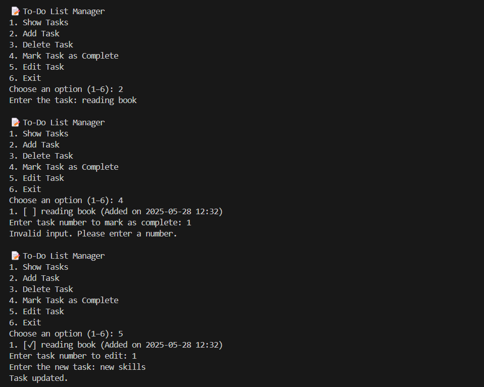

# 📝 Command-Line To-Do List Manager

This is **Task 1** of my Python internship at **Sarvagna Innovation Pvt. Ltd.**

## 📌 Project Description

A powerful command-line To-Do List Manager using Python.  
This tool allows users to:
- ✅ View all tasks
- ➕ Add new tasks with timestamp
- ❌ Delete tasks
- ☑️ Mark tasks as complete
- ✏️ Edit tasks with update timestamp

Tasks are saved in a local text file (`tasks.txt`) so they remain even after exiting.

---

## 🧠 Skills Practiced

- Python Functions
- File Handling
- List & String Operations
- Command-Line Interface (CLI)
- Error Handling & Validation
- Project Structuring in VS Code

---

## 📂 Project Files

| File | Description |
|------|-------------|
| `todo.py` | Main Python script |
| `tasks.txt` | Automatically created to store tasks |

---

## 🧪 How to Run

### 🔧 Requirements:
- Python 3.8+
- VS Code or any code editor

### 🚀 Run Command:
```bash
python todo.py

## 🖥️ Sample Menu Output

```text
📝 To-Do List Manager
1. Show Tasks
2. Add Task
3. Delete Task
4. Mark Task as Complete
5. Edit Task
6. Exit
```
## 🖼️ Demo Screenshot

Here’s a screenshot showing the To-Do List Manager in action:



